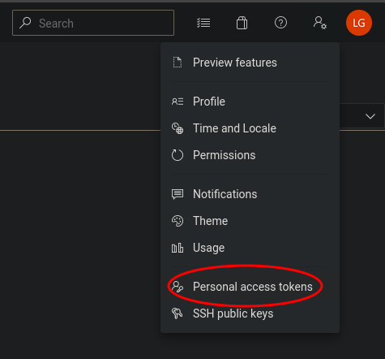

# Contributing

## Contributions From Aqua

### What you need

- Your own Azure DevOps Organisation (for testing)
- Access to the Aqua Security Azure DevOps Organisation (for publishing)
- A GitHub account with write access to this repository.

There are two published versions of this extension - the real, public version, and a private, test version.

The test version exists so we can publish a version and test it amongst ourselves before publishing to the real version.

- Test: https://marketplace.visualstudio.com/items?itemName=AquaSecurityOfficial.trivy-official-dev
- Real: https://marketplace.visualstudio.com/items?itemName=AquaSecurityOfficial.trivy-official

You'll need to give your test organisation with access to the test version, which you can do by adding to the `-- --share-with` arg to the `npm run publish`.

You can follow the [guide](marketplace.md) to install the extension to your test organisation.

### Updating the Publisher Token

The extension is published using an API which requires an _Azure Publisher Token_. This is [stored as a secret](https://github.com/aquasecurity/trivy-azure-pipelines-task/settings/secrets/actions) named `PUBLISHER_TOKEN` in the GitHub repository.

To update the token, you'll need to create a personal access token in _Azure Dev Ops_ with access to publish extensions to the Aqua organisation. You can then update the secret in the GitHub repository with this key. Setting it to expire after a short period is good practice.

### Testing a New Version

Manually trigger [GitHub Workflow](https://github.com/aquasecurity/trivy-azure-pipelines-task/actions/workflows/publish-dev.yml) that will build and publish a test version of the extension. Wait a few minutes and then try running the extension in your test organisation.

### Publishing a New Version

After ensuring you have published a test version of the extension, and tested it, you can publish the real version.

After merging your changes to the `main` branch, create a semver tag that is prefixed with `v` on your branch, such as `v1.2.3`, and push it. This will trigger a GitHub action that will publish a new version of the extension. Wait a few minutes and then try running the extension in your test organisation to confirm it works.
