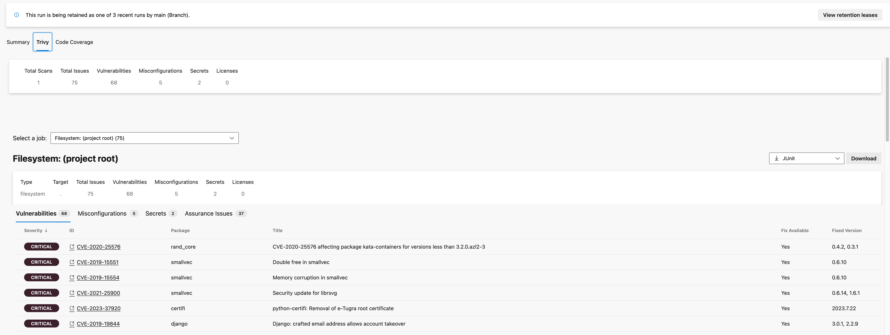
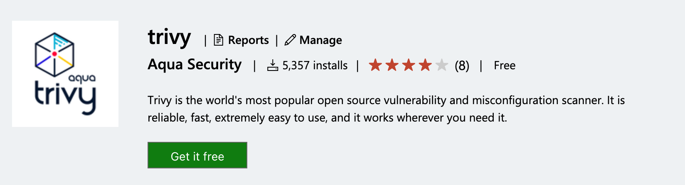

# Aqua Trivy Azure DevOps Extension

An Azure DevOps Pipelines Task for [Trivy](https://github.com/aquasecurity/trivy), providing vulnerability scanning with an integrated UI.



## Overview

This extension allows you to scan various targets for:

- Vulnerabilities in applications and dependencies
- Misconfigurations in Infrastructure as Code (IaC) files
- Secrets accidentally committed to repositories
- License compliance issues

## Quick Start

1. Install the Trivy task from the [Azure DevOps Marketplace](https://marketplace.visualstudio.com/items?itemName=AquaSecurityOfficial.trivy-official) and press the `Get it free` button.



2. Add the task to your `azure-pipelines.yml`:

```yaml
steps:
  - task: trivy@2
    inputs:
      type: 'filesystem'
      target: '.'
      scanners: 'vuln,misconfig,secret'
```

> [!Important]
> Docker integration is only fully supported on Linux agents. Windows agents have limited Docker support.

## Documentation

Check out the [documentation](docs/README.md) for more details:

- [Installation Guide](docs/installation.md)
- [Trivy@1 Configuration](docs/trivyv1.md) (Legacy version)
- [Trivy@2 Configuration](docs/trivyv2.md) (Recommended for new users)
- [Aqua Platform Integration](docs/connectedservice.md)
