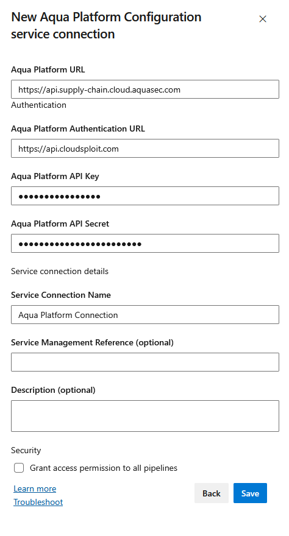

# Configuring Aqua Platform Service

When using the Azure Pipeline Task with Aqua Platform, previously you would configure the `AQUA_KEY` and `AQUA_SECRET` as variables and reference them in the YAML for the task. This change moves the configuration of the Aqua Platform connection to the connected settings.

## Configuring

1. Go to `Project Settings`
2. Choose `Service Connections`
3. Choose `New Service Connection` button on the top right of the screen
4. Select `Aqua Platform Configuration` from the list of available setups and configure with the details from your account
   1. Ensure you give the Connection a sensible name
   2. Ensure that the URLs are correct regional URLs for your account
   3. See [Aqua Documentation](https://docs.aquasec.com/saas/getting-started/welcome/saas-regions/) for more information
      
