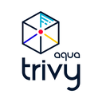

# Installing the Aqua Trivy Azure DevOps Extension

This guide covers the steps to install the Aqua Trivy extension for Azure DevOps pipelines.

## Installation from the Azure DevOps Marketplace

### For Organization Administrators

1. Navigate to the [Aqua Trivy extension page](https://marketplace.visualstudio.com/items?itemName=AquaSecurityOfficial.trivy-official) in the Azure DevOps Marketplace.

2. Click the **Get it free** button.

   

3. Select the Azure DevOps organization where you want to install the extension.

4. Click **Get It Free** to complete the installation.
   

5. Once installed, the Trivy task will be available for use in your Azure DevOps pipelines.

### For Project Contributors (Non-Administrators)

If you're not an organization administrator, you can request the extension to be installed:

1. Navigate to the [Aqua Trivy extension page](https://marketplace.visualstudio.com/items?itemName=AquaSecurityOfficial.trivy-official) in the Azure DevOps Marketplace.

2. Click the **Get it free** button.

3. Select the Azure DevOps organization where you want the extension installed.

4. You'll see an option to **Request** the extension. Click it to send a request to your organization administrators.

5. The administrator will receive a notification to review and approve your request.

## Verification

To verify that the extension has been installed successfully:

1. In your Azure DevOps organization, go to a project.

2. Navigate to **Pipelines** → **New Pipeline** or edit an existing one.

3. When configuring the pipeline tasks, search for "trivy" in the task search box.

4. The Trivy task should appear in the search results, confirming it's been installed correctly.

## Adding to Your Pipeline

After installation, you can add the Trivy task to your pipeline YAML:

```yaml
steps:
  - task: trivy@2 # For the recommended newer version
    inputs:
      type: 'filesystem'
      target: '.'
      scanners: 'vuln,misconfig,secret'
```

Or for the legacy version:

```yaml
steps:
  - task: trivy@1
    inputs:
      type: 'fs'
      path: '.'
```

## Next Steps

After installing the extension, you can proceed to:

- [Configure Trivy@1](trivyv1.md) (Legacy version)
- [Configure Trivy@2](trivyv2.md) (Recommended for new users)
- [Set up Aqua Platform integration](connectedservice.md)
