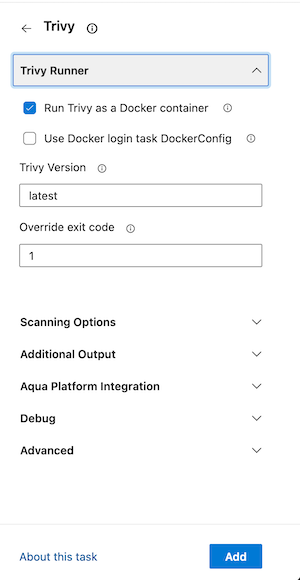

# Trivy v1 Configuration

| :warning: If you are new to the Trivy Azure Pipeline task, you would be better using the [Trivy v2 task](trivyv2.md)

Configuring the task can be done directly editing the pipeline yaml or through the configuration pane on the right of the pipeline UI screen

Select the Trivy task from the installed tasks


The input variables are grouped logically, expand the sections to make the required changes.



## Input Variables

You can supply several inputs to customise the task.

### Trivy Runner

| Input                   | Type   | Defaults | Description                                                                                                                       |
| ----------------------- | ------ | -------- | --------------------------------------------------------------------------------------------------------------------------------- |
| `version`               | string | latest   | The version of Trivy to use. Currently defaults to `latest`.                                                                      |
| `useSystemInstallation` | bool   | false    | Use Trivy executable pre-installed as system package. If this option is used, the 'version' option is ignored.                    |
| `loginDockerConfig`     | string |          | Set this to true if the `Docker login` task is used to access private repositories. Defaults to `false`.                          |
| `exitCode`              | number | 1        | The exit-code to use when Trivy detects issues. Set to `0` to prevent the build failing when Trivy finds issues. Defaults to `1`. |
| `docker`                | bool   | true     | Run Trivy using the aquasec/trivy docker image. Alternatively the Trivy binary will be run natively. Defaults to `true`.          |

### Scanning

| Input           | Type   | Defaults    | Description                                                                                                                                  |
| --------------- | ------ | ----------- | -------------------------------------------------------------------------------------------------------------------------------------------- |
| `type`          | string | image       | The type of scan to perform, can be a filesystem scan or an image scan.                                                                      |
| `severities`    | string | all (unset) | The severities (`CRITICAL,HIGH,MEDIUM,LOW,UNKNOWN`) to include in the scan (comma separated). Defaults to `CRITICAL,HIGH,MEDIUM,LOW,UNKNOWN` |
| `scanners`      | string | all (unset) | Choose which scanners to run (vuln, misconfig, secret) to be included (comma separated).                                                     |
| `path`          | string |             | The path to scan relative to the root of the repository being scanned, if an `fs` scan is required. Cannot be set if `image` is set.         |
| `image`         | string |             | The image to scan if an `image` scan is required. Cannot be set if `path` is set.                                                            |
| `ignoreUnfixed` | bool   | false       | When set to `true` all unfixed vulnerabilities will be skipped. Defaults to `false`.                                                         |

### Debug

| Input     | Type | Defaults | Description                                         |
| --------- | ---- | -------- | --------------------------------------------------- |
| `devMode` | bool | false    | Enable development mode (used for internal testing) |
| `debug`   | bool | false    | Enable debug logging in the build output.           |

### Aqua Platform Integration

| Input        | Type   | Defaults | Description                                                                                     |
| ------------ | ------ | -------- | ----------------------------------------------------------------------------------------------- |
| `aquaSecret` | string |          | The Aqua API Secret to use to link scan results to your Aqua Security account _(not required)_. |
| `aquaKey`    | string |          | The Aqua API Key to use to link scan results to your Aqua Security account _(not required)_.    |

### Additional Options

| Input     | Type   | Defaults | Description                                                                     |
| --------- | ------ | -------- | ------------------------------------------------------------------------------- |
| `options` | string |          | Additional flags to pass to trivy. Example: `--timeout 10m0s` _(not required)_. |

### Additional Outputs

The `Additional Output` section has check boxes to choose which reports you want to be added to the build.
These are available from the results header section or from the Trivy results page using the `Download Report` dropdown.


| Input             | Type | Defaults | Description                                                |
| ----------------- | ---- | -------- | ---------------------------------------------------------- |
| `cosignOutput`    | bool | false    | Create an output report in the Cosign vulnerability format |
| `cyclonedxOutput` | bool | false    | Create an output report in the CycloneDX format            |
| `jsonOutput`      | bool | false    | Create an output report in the JSON format                 |
| `sarifOutput`     | bool | false    | Create an output report in the SARIF format                |
| `spdxjsonOutput`  | bool | false    | Create an output report in the SPDX-JSON format            |
| `spdxOutput`      | bool | false    | Create an output report in the SPDX format                 |
| `tableOutput`     | bool | false    | Create an output report as a table                         |

## Output Variables

Output variables allow you to get information from previous sections of the pipeline

| Output            | Description                                     |
| ----------------- | ----------------------------------------------- |
| `cosignReport`    | Output path for the Cosign vulnerability report |
| `cyclonedxReport` | Output path for the CycloneDX report            |
| `jsonReport`      | Output path for the JSON report                 |
| `sarifReport`     | Output path for the SARIF report                |
| `spdxReport`      | Output path for the SPDX report                 |
| `spdxjsonReport`  | Output path for the SPDX JSON report            |
| `tableReport`     | Output path for the table report                |

### Example of scanning multiple targets

```yaml
trigger:
  - main

pool:
  vmImage: ubuntu-latest

jobs:
  - job: Scan the local project
    steps:
      - task: trivy@1
        version: v0.59.0
        inputs:
          path: .
  - job: Scan the ubuntu image
    steps:
      - task: trivy@1
        inputs:
          image: ubuntu
```

## Scanning Images in Private Registries

You can scan images in private registries by using the `image` input after completing a `docker login`. For example:

```yaml
steps:
  - task: Docker@2
    displayName: Login to ACR
    inputs:
      command: login
      containerRegistry: dockerRegistryServiceConnection1
  - task: trivy@1
    inputs:
      image: my.private.registry/org/my-image:latest
      # Needed to access private repo
      loginDockerConfig: true
```

## Scanning with Aqua Platform support

You can add your Aqua credentials to the task. To ensure the credentials are kept secure, you should put the `AQUA_KEY` and `AQUA_SECRET` in variables, then reference the variables in the input

```yaml
- job: Scan a local project with Aqua Integration
  steps:
    - task: trivy@1
      displayName: 'Scan project for everything'
      inputs:
        docker: false
        version: 'latest'
        path: '.'
        scanners: 'vuln,misconfig,secret,license'
        severities: 'UNKNOWN,LOW,MEDIUM,HIGH,CRITICAL'
        ignoreUnfixed: true
        aquaKey: '$(AQUA_KEY)'
        aquaSecret: '$(AQUA_SECRET)'
```
