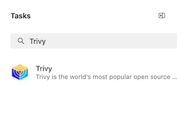
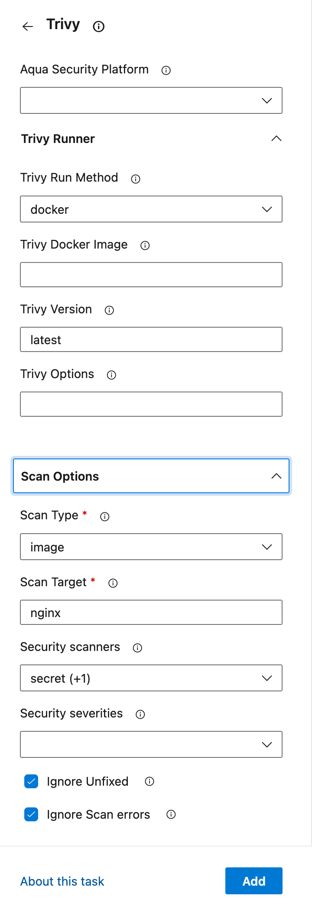

# Trivy v2 Configuration

Configuring the task can be done directly editing the pipeline yaml or through the configuration pane on the right of the pipeline UI screen

Select the Trivy task from the installed tasks



The input variables are grouped logically, expand the sections to make the required changes.



## Input Variables

You can supply several inputs to customise the task.

### Aqua Platform Integration

For more information about creating the connected service, see [Configuring Aqua Connected Service](connectedservice.md)

| Input          | Type                          | Defaults | Description                                           |
| -------------- | ----------------------------- | -------- | ----------------------------------------------------- |
| `aquaPlatform` | connectedService:AquaPlatform |          | Select the Aqua Security Platform service connection. |

### Trivy Runner

| Input                             | Type     | Defaults | Description                                                                                                                                                                               |
| --------------------------------- | -------- | -------- | ----------------------------------------------------------------------------------------------------------------------------------------------------------------------------------------- |
| `method`                          | pickList | install  | Specify how Trivy should be executed: `install` to download Trivy from GitHub releases, `docker` to run Trivy as a Docker container, or `system` to use a pre-installed Trivy executable. |
| `image`                           | string   |          | Specify a custom Trivy Docker image to use. If set, the `version` option is ignored. Visible only when `method = docker`.                                                                 |
| `trivyUrl`                        | string   |          | Specify a custom URL to download Trivy from (e.g., internal mirror/proxy). If set, the 'version' option is ignored. Only visible when not using system installation or Docker mode.       |
| `skipDownloadCertificateChecking` | bool     | false    | Skip TLS certificate validation when downloading Trivy. **WARNING:** Insecure - only use in trusted environments with self-signed certificates. Only visible when `trivyUrl` is set.      |
| `version`                         | string   | latest   | Specify the version of Trivy to use. Ignored if a custom Trivy Docker image is specified. Visible unless `method = system` or `image` is set.                                             |
| `options`                         | string   |          | Provide additional command-line options to pass to the Trivy executable.                                                                                                                  |

---

### Scan Options

| Input                     | Type     | Defaults | Description                                                                                                                                                                                                                                                   |
| ------------------------- | -------- | -------- | ------------------------------------------------------------------------------------------------------------------------------------------------------------------------------------------------------------------------------------------------------------- |
| `type`                    | pickList |          | The type of scan to perform. Options: `filesystem`, `image`, `repository`.                                                                                                                                                                                    |
| `target`                  | string   |          | The specified target will be scanned using the selected scan type.                                                                                                                                                                                            |
| `scanners`                | pickList |          | Choose which scanners to run. Options: `license`, `misconfig`, `secret`, `vuln`. Multi-select is supported.                                                                                                                                                   |
| `severities`              | pickList |          | Severities of security issues to be displayed. Options: `UNKNOWN`, `LOW`, `MEDIUM`, `HIGH`, `CRITICAL`. Multi-select is supported.                                                                                                                            |
| `ignoreUnfixed`           | boolean  | false    | Include only fixed vulnerabilities.                                                                                                                                                                                                                           |
| `failOnSeverityThreshold` | pickList |          | Set a threshold for failing the task based on the highest severity level found during the scan. If set, the task will fail if any issue with a severity equal to or higher than this level is found. Options: `UNKNOWN`, `LOW`, `MEDIUM`, `HIGH`, `CRITICAL`. |
| `ignoreScanErrors`        | boolean  | false    | Ignore scan errors and continue the pipeline with a `SucceededWithIssues` result.                                                                                                                                                                             |

---

### Reports

| Input       | Type     | Defaults | Description                                                                                                                                                                                                                       |
| ----------- | -------- | -------- | --------------------------------------------------------------------------------------------------------------------------------------------------------------------------------------------------------------------------------- |
| `reports`   | pickList |          | Select additional reports to generate. JSON report is always generated. Options: `asff`, `cosign`, `cyclonedx`, `github`, `html`, `junit`, `sarif`, `spdx`, `spdxjson`, `table`. Multi-select is supported.                       |
| `publish`   | boolean  | false    | Publish generated reports as pipeline artifacts.                                                                                                                                                                                  |
| `templates` | string   |          | Specify a custom directory containing templates for the ASFF, HTML, JUnit reports. If not set, will look up in the `contrib` directory of the Trivy installation. Visible only when `method = system` and `reports` is not empty. |

## Examples

### Scanning multiple targets and publish results as test run

```yaml
steps:
  - task: trivy@2
    name: TrivyCurrent
    displayName: 'Scan current repository as filesystem'
    inputs:
      version: 'latest'
      type: 'filesystem'
      target: '.'
      scanners: 'misconfig,vuln,secret'
      ignoreUnfixed: true
      ignoreScanErrors: true
      reports: 'github, html, junit'
      publish: true

  - task: trivy@2
    name: TrivyPrivate
    displayName: 'Scan private GitHub repository'
    inputs:
      type: 'repository'
      target: 'https://github.com/owner/repo'
      scanners: 'secret,vuln,misconfig'
      ignoreUnfixed: true
      reports: 'github, junit, sarif'
    env:
      GITHUB_TOKEN: $(GITHUB_TOKEN)

  - task: PublishTestResults@2
    inputs:
      testResultsFormat: 'JUnit'
      testResultsFiles: |
        $(TrivyCurrent.junitReport)
        $(TrivyPrivate.junitReport)
      searchFolder: '$(Agent.TempDirectory)'
      testRunTitle: 'Trivy'
      publishRunAttachments: false
```

### Scanning Images in Private Registries

You can scan images in private registries by using the `image` input after completing a `docker login`. For example:

```yaml
steps:
  - task: Docker@2
    displayName: Login to container registry
    inputs:
      command: login
      containerRegistry: containerRegistryServiceConnection

  - task: trivy@2
    inputs:
      type: 'image'
      target: my.private.registry/org/my-image:latest
```

### Scanning with Aqua Platform support

Configure your Connected Service using the [service endpoint docs](connectedservice.md).

> [!IMPORTANT]
> Aqua Platform integration only works for `install` mode and does not support `image` scanning.

```yaml
steps:
  - task: trivy@2
    inputs:
      aquaPlatform: 'Aqua Platform Connection'
      version: 'latest'
      type: 'filesystem'
      target: '.'
      scanners: 'misconfig,vuln,secret'
      ignoreUnfixed: true
      ignoreScanErrors: true
      reports: 'github, html, junit'
      publish: true
```

### Using Custom Download URL with Self-Signed Certificates

If you're downloading Trivy from an internal mirror or proxy with self-signed certificates, you can use the `trivyUrl` and `skipDownloadCertificateChecking` inputs:

```yaml
steps:
  - task: trivy@2
    inputs:
      method: 'install'
      trivyUrl: 'https://internal-mirror.company.com/trivy/releases/download/v0.60.0/trivy_0.60.0_Linux-64bit.tar.gz'
      skipDownloadCertificateChecking: true
      type: 'filesystem'
      target: '.'
      scanners: 'vuln,misconfig,secret'
```

> [!WARNING]
> Only use `skipDownloadCertificateChecking: true` in trusted environments. This disables certificate validation and is inherently insecure.
