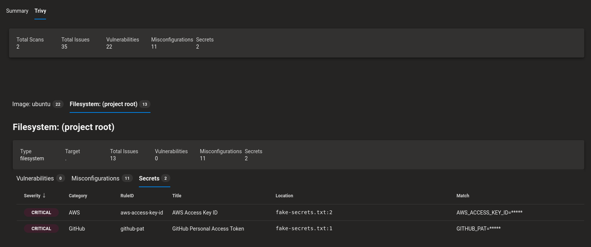

# trivy



## Installation

1. Install the trivy task in your Azure DevOps organization (hit the `Get it free` button above).

2. Add the task to your `azure-pipelines.yml` in a project where you'd like to run trivy:

```yaml
- task: trivy@1
```

## Configuration

You can supply several inputs to customise the task.

