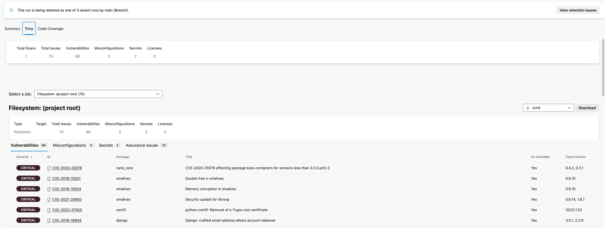

# Aqua Trivy

An Azure DevOps Pipelines Task for [Trivy](https://github.com/aquasecurity/trivy), with an integrated UI.

## Installation

1. Install the Trivy task in your Azure DevOps organisation (hit the `Get it free` button above).

2. Add the task to your `azure-pipelines.yml` in a project where you'd like to run Trivy:

## Agents Compatibility

| Agent OS | Run binary | Scan FileSystem | Docker |
| :------- | :--------: | :-------------: | :----: |
| Linux    |     ✅     |       ✅        |   ✅   |
| MacOS    |     ✅     |       ✅        |   🔴   |
| Windows  |     ✅     |       ✅        |   🔴   |

### Self-Hosted Agents

Access to Docker Engine is required to run Trivy in docker container or scan docker images.

While you can attempt to scan Docker images on Windows, running the task using a Docker image will mostly fail.

## Configuration

If new to the Trivy pipeline task, you should use the newer v2 version.

[Trivy@1 Configuration](https://github.com/aquasecurity/trivy-azure-pipeline-task/docs/trivyv1.md)

[Trivy@2 Configuration](https://github.com/aquasecurity/trivy-azure-pipeline-task/docs/trivyv2.md)
